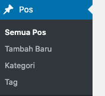
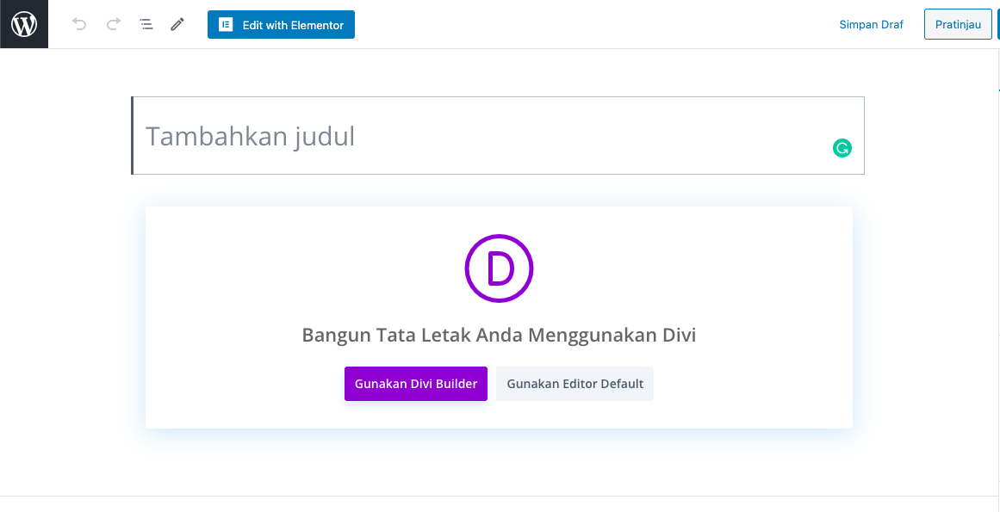
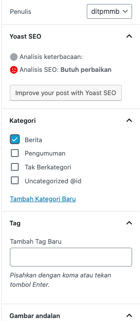
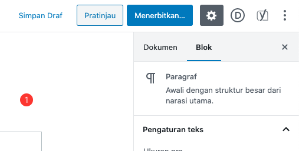
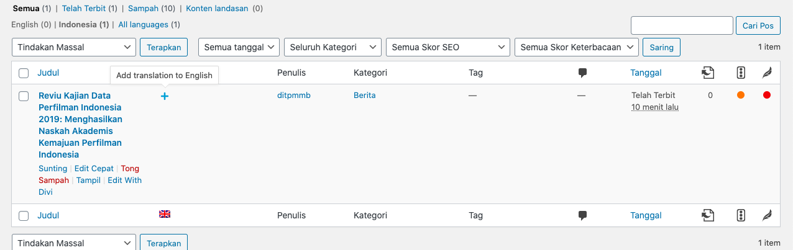

# Menambahkan Pos Baru
1. Pilih menu Pos kemudian pilih menu Tambah Baru

2. Tambahkan judul dan isi dengan pilih "Gunakan editor default"

3. Jika konten sudah di isi, pilih kategori untuk pos baru. Klik tab `Dokumen` pada bilah sebelah kanan dan pilih salah satu/lebih kategori.

4. Jika sudah selesai semuanya, Anda bisa menerbitkan postingan dengan mengklik button "Menerbitkan" sebelah kanan atas

## Menambahkan artikel bahasa inggris
1. Pilih menu semua pos pada menu sebelah kanan
2. Klik ikon "tambah" pada pos yang akan ditranslate

3. Isi konten seperti biasa
4. Terbitkan jika pos sudah di translate